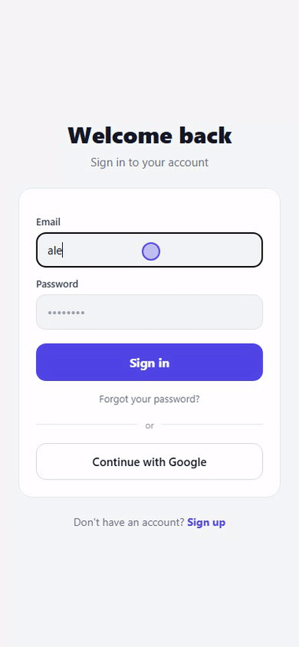

# Expo + Supabase Starter

Most Expo starters hand you screens. This one handles the things that break three
months in, which are the ones you don't know exist until they happen to you: a
query that hangs forever after the phone sleeps, a sign-out that never returns
offline, an auth callback that deadlocks, and Row-Level Security that looks
correct while handing every column of the row to the client.

Each of those is in here with the fix, extracted from apps I ship. MIT.

- **Stack:** Expo SDK 57 · Expo Router · TypeScript · Zustand · Supabase · Jest
- **Targets:** Android, iOS, and Web (react-native-web, single-page app)

<p align="center">
  
</p>

<p align="center"><sub>Email sign-in, session handling and the navigation guard, running on the web target.</sub></p>

---

## Features

| | |
|---|---|
| **RLS down to the column** | RLS filters rows, not columns — a correct policy still returns every field of a row you can read. The first migration revokes `email` at the column level and makes it immutable, so `select('*')` fails by design. Copy the pattern for your own sensitive fields. |
| **A test that proves it** | `supabase/tests/rls_smoke.sql` assumes a real user's identity inside a rolled-back transaction and asserts what they *can't* reach. It refuses to report a pass on a project with fewer than two accounts, because "sees no other rows" is trivially true on an empty database. |
| **`withTimeout`** | supabase-js can hang forever after the phone dozes: no error, no rejection, a spinner that never stops. Every query is wrapped so a dead promise becomes a real failure you can handle. |
| **Durable offline queue** | Persisted write queue with coalescing and exponential backoff. Writes survive losing connection, and the timer is what guarantees they converge, not the connectivity events. |
| **Session handling** | Synchronous `onAuthStateChange` (awaiting inside it deadlocks the auth library), account-switch detection, and a sign-out that works offline. |
| **Email + Google auth** | Sign up, sign in, sign out, password reset. Google needs a different flow on web than on native, and both are here. |
| **Navigation guard** | One guard redirects by session and recovery state, with no login-screen flicker on boot. |
| **Tests** | Jest (`jest-expo`) with example unit tests, plus typecheck and lint scripts that run clean from a fresh clone. |

---

## Quick start

```bash
# 1. Install
npm install

# 2. Create a Supabase project at https://supabase.com/dashboard
#    then run supabase/migrations/001_initial_schema.sql (SQL Editor).

# 3. Configure env
cp .env.example .env
#    Fill EXPO_PUBLIC_SUPABASE_URL and EXPO_PUBLIC_SUPABASE_ANON_KEY
#    (Dashboard → Project Settings → Data API / API Keys).

# 4. Run
npx expo start          # scan the QR with Expo Go (Android)
npx expo start --web    # or run it in the browser
```

Sign up and you're in.

> Testing with `you@example.com` will bounce with *"Email address is invalid"* —
> Supabase's validator rejects reserved domains. Use any real-looking one.

---

## Setup guides

### Google OAuth
1. **Google Cloud Console** → create a project → **OAuth consent screen** (External, add your email as a test user).
2. **Credentials → Create OAuth client ID → Web application**. Under *Authorized redirect URIs* add:
   ```
   https://<your-ref>.supabase.co/auth/v1/callback
   ```
   Copy the **Client ID** and **Client Secret**.
3. **Supabase → Authentication → Providers → Google**: enable it, paste the Client ID + Secret.
4. **Supabase → Authentication → URL Configuration → Redirect URLs**: add your app's redirect URIs. For web dev:
   ```
   http://localhost:8081
   http://localhost:8081/**
   ```
   For native, add your scheme: `exposupabasestarter://`.

### Password recovery
The reset email links to a **web page** (mobile completes the reset on the web). Set `EXPO_PUBLIC_RESET_REDIRECT_URL` to that page's URL, and add it to the Supabase Redirect URLs allowlist. On web, `detectSessionInUrl` (already enabled) parses the token and fires the `PASSWORD_RECOVERY` event, which routes the user to the reset screen.

---

## Project structure

```
src/
  app/                     # Expo Router routes
    _layout.tsx            # root layout + NavigationGuard
    index.tsx              # authenticated home
    (auth)/                # sign-in, register, forgot-password
    reset-password.tsx     # password recovery
  hooks/use-auth.ts        # session boot, listener, auth actions
  lib/
    supabase.ts  withTimeout.ts  store.ts  confirm.ts  googleAuth.ts
    syncQueue.ts           # durable offline queue
supabase/
  migrations/001_initial_schema.sql
```

---

## Testing

```bash
npm test           # jest
npm run typecheck  # tsc (app + tests)
```

---

## Web / SPA note

> If a web export ever boots with *"Missing EXPO_PUBLIC_..."* while your `.env`
> is filled in, it's the Metro cache: the module was transformed once without the
> variables and Babel folded them to `undefined`. Re-run with
> `npx expo export -p web --clear`.

`app.json` sets `web.output: "single"` (SPA). An auth-gated app can't be statically
prerendered — Supabase's session lives in the browser, so server-side rendering
hits `window is not defined`. SPA is the right default here.

---

## Before you ship

- [ ] Run `supabase/migrations/001_initial_schema.sql` against **your** project.
- [ ] Enable **Leaked Password Protection** (Auth → Policies) — it checks new
      passwords against HaveIBeenPwned.
- [ ] Keep `service_role` out of the client. Anything prefixed `EXPO_PUBLIC_`
      ends up in the bundle, which is public.
- [ ] Select explicit columns instead of `select('*')`. Migration 001 revokes
      `email` at the column level, so `select('*')` fails on `profiles`.
      **RLS gates rows, not columns** — a correct policy still hands back every
      column of a row you're allowed to read, which is why the grant matters.
- [ ] Know the write-side version of that trap:
      ```ts
      await supabase.from('profiles').update({ display_name })            // fine
      await supabase.from('profiles').update({ display_name }).select()   // 42501
      await supabase.from('profiles').update({ display_name })
        .select('id, display_name')                                       // fine
      ```
      The failing one reads the row back with `select=*` and errors with a hint
      telling you to `GRANT SELECT ON public.profiles` — follow it and you undo
      the hardening. Name the columns instead.
- [ ] Prove isolation rather than reading the policy and nodding: sign up two
      users and run `supabase/tests/rls_smoke.sql`. It refuses to report a pass
      with fewer than two accounts, because with one "sees no other rows" is
      true for lack of data.

---

## Pro version

This repo is complete on its own and nothing here is a teaser. If your app grows
into shared data between users, there's a paid edition that adds the features most
apps eventually need, already built,
RLS-hardened, and covered by a reproducible database security test:

- **Shared groups** — create/join by invite code, members, ownership transfer.
- **Private-or-shared data pattern** — the exact RLS recipe for data that's private
  or shared with a group, with a working `notes` demo.
- **Column hardening on the write side** — this repo shows the read pattern on
  `profiles`; the paid edition applies it across the shared tables and restricts
  *which columns* a member may update, which is what stops someone editing a row
  they legitimately own into something they shouldn't be.
- **Edge function template** — a shared-secret authenticated endpoint (webhook/cron).
- **"12 common mistakes" guide** — the Expo + Supabase pitfalls that cost real
  debugging time, with symptom → cause → fix → code.

👉 **Get the Pro version:** https://guidondor.gumroad.com/l/expo-supabase-pro

---

## License

MIT — see [LICENSE](LICENSE). Provided "as is", without warranty; you're responsible
for auditing and securing anything you ship.
